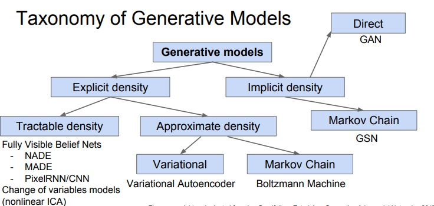
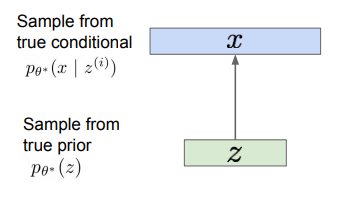
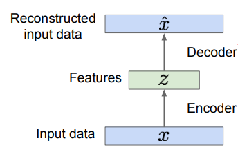
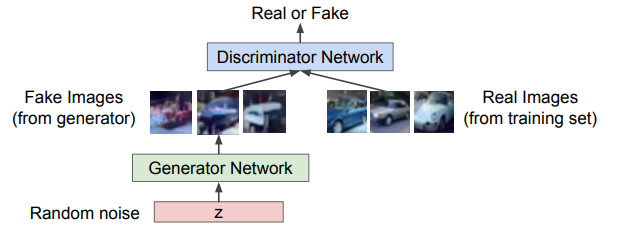

# Supervised vs Unsupervised Learning 
## Supervised Learning
* Data : (x, y) x is data, y is label
* Goal : Learn a *function* to map x -> y
* Examples : Classification, regression, object detection, semantic segmentation, image captioning, etc.

## Unsupervised Learning
* Data : x. just data, no labels
* Goal : Learn some underlying hidden *structure* of the data
* Examples : Clustering, dimensionality reduction, feature learning, density estimation, etc.

# Generative Models(unsupervised)
> Given training data, generate new samples from same distribution
* approach
	- Explicit density estimation : explicitly define and solve for p_model(x)
	- Implicit density estimation : learn model that can sample from p_model(x) w/o explicitly defining it

* Taxonomy

this class will discuss about 3 most popular types models
(PixelRNN/CNN, Variational Autoencoder(VAE), GAN)

## PixelRNN/CNN(Explicit density model)
> Fully visible belief network, 
> Use chain rule to decompose likelihood of an image x into product of 1-d distributions  
>> Explicit density model, optimizes exact likelihood, good samples. But inefficient sequential generation

>
* objective : maximize likelihood of training data

* Generate image pixels starting from corner using RNN(LSTM) or CNN

## Variational Autoencoder(VAE)
> Probabilistic spin on autoencoders => sample from the model to generate data
>> Optimize variational lower bound on likelihood. Useful latent representation, inference queries. But current sample quality not the best

* problem

* Q: Latent variable Z의 차원수를 직접 결정해줘야하는지?
   A: 직접 명시해줘야함
   

### Autoencoder(background)
> Unsupervised approach for learning a lower-dimensional feature representation from unlabeled training data
> Train such that features can be used to reconstruct original data "Autoencoding" - encoding itself

* 

## GAN(Generative Adversarial Networks)
> Sample from a simple distribution w/o explicitly density estimation
>> Game-theoretic approach, best samples! But can be tricky and unstable to train, no inference queries.

> Minimax objective function:  

> Alternate between:
	>> Gradient ascent on discriminator 
	>> 
	>> Gradient descent on generator
	>> 

### Background Idea
* Two-player game
	* Generator network : try to fool the discriminator by generating real-looking images
	* Discriminator network : try to distinguish between real and fake images

Reference
* http://cs231n.github.io/ 

<!--stackedit_data:
eyJoaXN0b3J5IjpbMzk3MTUxNDkzLC0xMDg3NzcxOTczLDM0OD
E1NzE1MSwtMTI1NzE0NzAyLC00NTk2NzE5NDUsLTE0NTI5Mzk0
OTgsMjU3MjEzMjk1LC0xMzkwNjAxNTY0LDEwOTA1MDY4NTksMT
EwMzE1NTg2NiwxNzYzMzY3MDIxLC0yMjExNTY3NSwzNzU4NDM0
MTAsLTE1NTA0OTg4MCwyOTc4MDY5MDYsLTk1MzI1NjA3NywxMD
I3NjAwODAwLDIwMDkyNDE3NSwxNzkwMzIzNzBdfQ==
-->