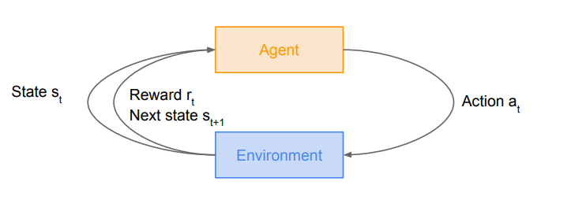
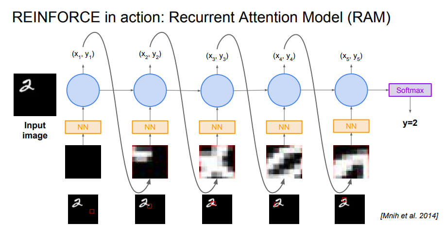

# Deep Reinforcement Learning
## Reinforcement Learning
> Problems involving an agent interacting with an environment, which provides numeric reward signals
* Goal : Learn how to take actions in order to maximize reward

## Markov Decision Process
> Mathematical formulation of the RL problem
> Markov property : Current state completely characterises the state of the world
> 

## The optimal policy **pi^*** 

## Q-learning
> Use a function approximator to estimate the action-value function
> 

### Experience Replay
> Learning from batches of consecutive samples is problematic:
* Samples are correlated - inefficient learning
* Current Q-network parameters determines next training samples - can lead to bad feedback loops
> addresses these problems using experience replay - continually update a replay memory table of transitions

### Policy Gradients
> Q-function can be very complicated. But the policy can be much simpler. If we can learn a policy directly, how about finding the best policy from a collection of policies?  
> 
> 
 
 * REINFORCE algorithm
 >![equation](https://latex.codecogs.com/gif.latex?%5C%5C%5Ctextrm%7BExpected%20reward%20%3A%7D%5C%5C%20%5Cbegin%7Balign*%7DJ%28%5Ctheta%29%20%26%3D%20%5Cmathbb%7BE%7D_%7B%5Ctau%5Csim%20p%28%5Ctau%3B%5Ctheta%29%20%7D%5Cbegin%7Bbmatrix%7Dr%28%5Ctau%29%5Cend%7Bbmatrix%7D%5C%5C%20%26%3D%20%5Cint_%7B%5Ctau%7Dr%28%5Ctau%29p%28%5Ctau%3B%5Ctheta%29d%5Ctau%20%5Cend%7Balign*%7D%20%5C%5C%5Ctextrm%7BDifferentiated%20term%20%3A%7D%5C%5C%20%5C%5C%20%5Cnabla_%7B%5Ctheta%7DJ%28%5Ctheta%29%20%3D%20%5Cint_%7B%5Ctau%7Dr%28%5Ctau%29%5Cnabla_%7B%5Ctheta%7Dp%28%5Ctau%3B%5Ctheta%29d%5Ctau%20%5C%5C%20%5Cnabla_%7B%5Ctheta%7Dp%28%5Ctau%3B%5Ctheta%29%3Dp%28%5Ctau%3B%5Ctheta%29%5Cfrac%7B%5Cnabla_%7B%5Ctheta%7Dp%28%5Ctau%3B%5Ctheta%29%7D%7Bp%28%5Ctau%3B%5Ctheta%29%7D%3D%7Bp%28%5Ctau%3B%5Ctheta%29%7D%5Cnabla_%7B%5Ctheta%7D%20%5Clog%20p%28%5Ctau%3B%5Ctheta%29%20%5C%5C%20%5C%5C%5Ctextrm%7BFinal%20Differentiated%20term%20%3A%7D%5C%5C%20%5C%5C%20%5Cnabla_%7B%5Ctheta%7DJ%28%5Ctheta%29%20%3D%20%5Cmathbb%7BE%7D_%7B%5Ctau%5Csim%20p%28%5Ctau%3B%5Ctheta%29%7D%5Cbegin%7Bbmatrix%7Dr%28%5Ctau%29%5Cnabla_%5Ctheta%20%5Clog%20p%28%5Ctau%3B%5Ctheta%29%5Cend%7Bbmatrix%7D)

* Vriance reduction
	*  First idea
		* Push up probabilities of an action seen, only by the cumulative future reward from that state
		
	* Second idea
		* Use discount factor lambda to ignore delayed effects
			
		
	* Third idea(Base line)
		* Use baseline which means standard reward degree and it can evaluates reward which is more or less than we expect
			

### Actor-Critic Algorithm

## REINFORCE in action
### RAM(Recurrent Attention Model)
> Take a sequence of "glimpses" selectively focusing on regions of the image, to predict class
* state : Glimpses seen so far
* Action : (x, y) coordinates (center of glimpse) of where to look next in image
* Reward : 1 at the final timestep if image correctly classified, 0 otherwise

Reference
* http://cs231n.github.io/ 
<!--stackedit_data:
eyJoaXN0b3J5IjpbMTIxNDQ1NDc4MywtMjEzODM5NzQ0NiwxMj
AxNzQzNDU0LC0xOTM1MDI5Nzc3LC0xMzI5NzE1MjA2LDEzNzIy
NjIxNjgsMTU0MzM3NDExNCwtMTY0MTQ3Nzk2OCw1MDUyMDg5NC
wtMjIzMzU4NjkyLC0yNDM2MDY0NDQsLTcyMzY0NDI4NSwtMTkx
NDg1ODM3MCw5NTE4ODI0NDYsMTY5MTIyOTE5OCwtMTgxMTA4Mj
IxNywyMzM4NzI4MTBdfQ==
-->