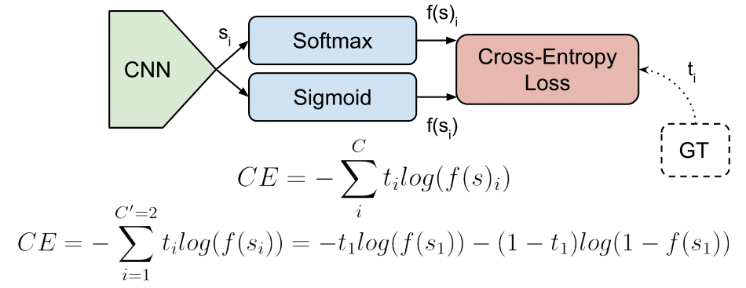

# Hypothesis
## Hypothesis
> Hypothesis =  WX(W : Weight / W Dimension : X features * number of y classes, X : Input / X Dimension : Number of Input * X features)
  * Tensorflow에서 구현시 : hypothesis = tf.matmul(X, W)로 XW의 위치 바뀜

# Activation Functions
## Softmax
> softmax는 input에 대한 출력은 0~1 사이의 값으로 정규화하며 output 값의 합이 항상 1이 되는 특성을 가짐
  * 상기 Hypothesis로 도출된 값은 Score에 불과하므로 softmax 통해서 Probabilities로 변환
  * Tensorflow에서 구현시 : hypothesis = tf.nn.softmax(hypothessis)
  
## Sigmoid
> 
* Squashes numbers to range [0, 1]
* Historically popular since they have interpretation as a saturating "firing rate" of a neuron
> 2 problems:
* Saturated neurons "kill" the gradients(ex, if x = -10 or 10, all backprop gredient will be "0")
* Sigmoid outputs are not zero-centered(so, gradient update is not efficient)

## tanh

* Squashes numbers to range [-1, 1]
* zero cent

# Cost Function
### MSE(Mean-Squared-Error)
  
  
### Cross entropy loss
> cross entropy loss(cost)는 Activation Function을 통해 도출한 Prediction value와 Ground Truth와의 차이 즉, cost를 산출
  * Tensorflow에서 구현시 : cost = tf.reduce_mean(-tf.reduce_sum(Y * tf.log(hypothesis), axis = 1)

# Gradient Descent
> Cost Function을 통해 cost를 산출했다면, cost를 낮추기 위해 W와 b, Learning Latio, Lambda 등 Hyperparameter의 Tuning이 필요 그에 대한 방법론이 Gradient Descent
>> forward : compute result of an operation and save any intermediates needed for gradient computation in memory
>> backward : apply the chain rule to compute the gradient of the loss function with respect to the inputs
>> backpropagation : recursive application of the chain rule along a computational graph to compute the gradients of all inputs/parameters/intermediates
  * Tensorflow에서 구현시 : optimizer = tf.train.GradientDescentOptimizer(learning_rate=0.1).minimize(cost)

* 보충 필요

## ReLU
  * NN에서 Activation Function으로 Sigmoid를 사용할 경우 출력이 0~1이므로, Layer가 커질수록 0에 매우 근접하게 됨.
  (즉, Layer1 - Output 단에 이르게 되면 사실상 영향력이 거의 없게 됨). 이로 인해서 ReLU를 사용함.
  
## RBM(Restricted Boltzmann Machine)
  * Weights에 적절한 초기값을 주기 위한 알고리즘. 자세한 내용은 참고
  그러나 굳이 RBM을 사용하지 않고 적당한 initial 값을 주어도 잘 작동함
  
  
# Overfitting

## More Training data

## ~~Reducing number of features~~

## Regularization

# Improving some methods performance of NN
## Dropout
  * Training할 때, Node 중 일부를 임의로 배제시키는 것. 

## Ensemble
  * 독립적으로 모델들을 학습시킨 후 combine 시키는 것

# Varication of NN
## Fast Forward(Resnet)
  * 일부 Layer를 건너 뛰어 
  
## Recurrent network(RNN)
  * 기존 NN이 Hierarchy상 상하로 진행되었다고 한다면, 상하좌우로 NN을 구성
  다음 포스팅에 상세 
  
# CNN(Convolutional Neural Network)
  * Input -> Convolution layer -> ReLU -> Pooling -> Convolution layer -> Relu -> Pooling ... -> FC -> output

  * Convolution layer에 Filter 적용시 size가 급격히 작아짐으로 인해 정보 손실이 커지게 될 수 있음. 이를 방지하기 위해
  padding을 통해서 급격한 size 축소를 막음으로써 정보 손실을 줄일 수 있음
  * Convolution layer output = (N - F) / stride + 1
  
  * Pooling할 때의 Filter는 activation map을 extract할 때 적용되는 Filter와 다름. 전자는 fixed, 후자는 runnable한 Filter임
  전자를 Filter가 아닌 Kernel로 지칭하기도 함.

출처 : https://gombru.github.io/2018/05/23/cross_entropy_loss/
http://hunkim.github.io/ml/
[cs231n](http://cs231n.github.io/)

<!--stackedit_data:
eyJoaXN0b3J5IjpbLTI0NTM1NTA1NiwtMjA5NzAwODEzNCwtNT
M3MzkxNTYxXX0=
-->